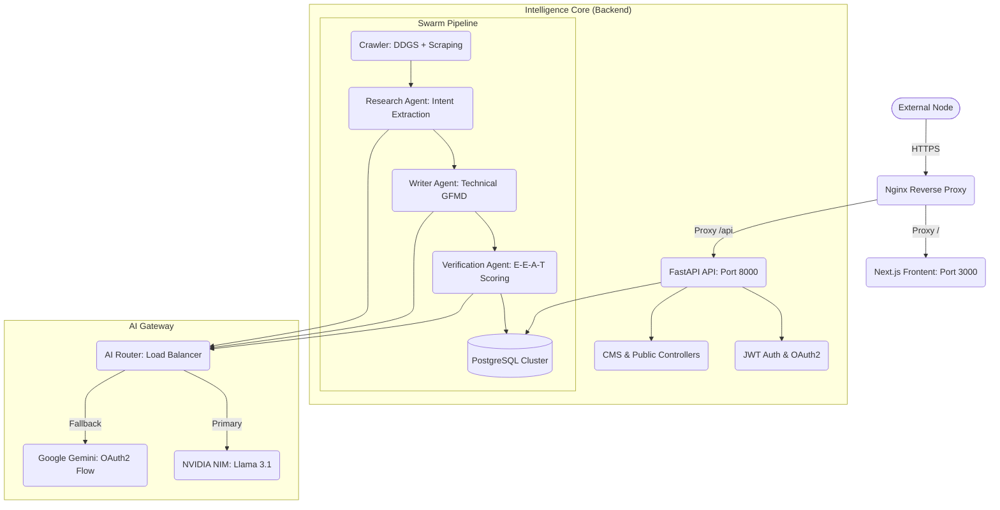

# SentinelReign Platform Architecture 🛡️
## Technical Intelligence & Autonomous Research Matrix

This document provides the definitive architectural map of the SentinelReign ecosystem—a production-grade, AI-driven technology research platform. It covers the full-stack implementation, the autonomous AI swarm logic, and the high-performance infrastructure optimizations.

---

## 1. Executive System Overview
SentinelReign is an autonomous intelligence node designed to crawl, research, verify, and publish technical literature without human intervention. 

### Core Tech Stack:
- **Frontend**: Next.js 15 (App Router), Tailwind CSS, Framer Motion, Lucide React.
- **Backend**: FastAPI (Python 3.12), SQLAlchemy 2.0, Pydantic v2.
- **Database**: PostgreSQL (Production) / SQLite (Development Fallback).
- **Process Management**: PM2 (Advanced mode with uvicorn bridging).
- **AI Orchestration**: NVIDIA NIM (Llama 3.1 70B) & Google Gemini 2.0 Pro.

### Master Flow Diagram:


---

## 2. Directory Structure Lexicon

```text
/www/wwwroot/sentinelreign.com/
├── v3-frontend/               # Next.js 15 Production Frontend
│   ├── src/
│   │   ├── app/               # App Router: Home, Articles, Login, Admin
│   │   ├── components/        # UI Matrix: ArticleCards, Navbar, ProtectedRoutes
│   │   ├── lib/               # Utilities & UI helper functions
│   │   └── hooks/             # Custom React lifecycle hooks
│   └── public/                # Static assets & brand identity
│
├── backend/                   # FastAPI Headless Intelligence Engine
│   ├── api/                   # Router Matrix (Admin, Auth, CMS, Public, Search)
│   ├── core/                  # Security (JWT), Config (Pydantic), Database (Session)
│   ├── models/                # SQLAlchemy Schemas: Analytics, Articles, User, CMS
│   ├── services/              # Swarm Logic: agents.py, ai_router.py, crawler.py
│   ├── alembic/               # Database migration versioning
│   ├── venv/                  # Isolated Python environment
│   └── main.py                # System Entrance & Lifespan Orchestrator
│
├── ai_memory/                 # Tactical Logic & System Prompts
│   ├── mission.md             # Core operational objectives
│   ├── soul.md                # AI tone mapping & technical persona
│   └── writing_style.md       # GFMD standards & formatting protocols
│
├── .env                       # Unified Environment Credentials
└── run_prod.sh                # Production environment bootstrapper
```

---

## 3. The Autonomous AI Intelligence Pipeline

The "Researcher Swarm" is the heart of SentinelReign. It operates in a multi-stage deterministic pipeline:

### 3.1. Exploration Phase (`crawler.py`)
- **Web Ingestion**: Uses `ddgs` (DuckDuckGo Search) to monitor technical keywords.
- **Memory Deduplication**: Cross-references the `AgentMemory` DB table. If a topic (e.g., "CVE-2024-XXXX") has been covered within the last 30 days, it is discarded to prevent redundancy.

### 3.2. Synthesis Phase (`agents.py`)
1.  **Research Agent**: Analyzes source material to extract structural intent (Tooling, Methodology, Threat Vector).
2.  **Writer Agent**: Composes 2000+ word deep-dives in **GFMD (Guard-Flavored Markdown)**. It strictly follows the `writing_style.md` persona—opinionated, technical, and data-heavy.
3.  **Verification Agent**: Fact-checks technical claims and assigns a `Confidence Score` based on E-E-A-T criteria.
4.  **SEO Agent**: Generates optimized meta-titles, descriptions, and JSON-LD structured data for Google Indexing.

### 3.3. AI Resilience Gateway (`ai_router.py`)
To ensure 100% uptime, the system uses a **Dual-Provider Failover**:
- **Primary**: **NVIDIA NIM** (Llama 3.1 70B) for high-speed technical inference.
- **Secondary**: **Google Gemini 2.0 Pro** via direct OAuth2 bridging if NVIDIA rate-limits or fails.

---

## 4. Frontend Architecture & SEO Matrix

The Next.js frontend is designed for "Visual Excellence" and "Search Dominance."

### 4.1. Visual Design System
- **Aesthetic**: Premium Dark Mode with Glassmorphism and Neon accents.
- **Micro-Animations**: Uses `framer-motion` for smooth layout transitions and "matrix-style" loading effects.
- **Responsive Fluidity**: Standardized Tailwind grid systems for mobile-first readability.

### 4.2. SEO & E-E-A-T (Expertise, Experience, Authoritativeness, Trustworthiness)
- **Static Site Generation (SSG) / Incremental Static Regeneration (ISR)**: Pre-renders articles for instantaneous load times.
- **Dynamic Metadata**: The `generateMetadata` function maps database content directly to `<title>`, `<meta>`, and OpenGraph tags.
- **Author Identity**: Fully integrated Author profile linking back to Syed Abrar's technical credentials to boost "Trusted Source" signals in Google Search.

---

## 5. Security & Infrastructure Protocols

### 5.1. Authentication Matrix
- **JWT Enforcement**: All administrative routes (`/api/admin/*`, `/api/cms/*`) require a valid Bearer Token.
- **Protected Routes**: React-level guards intercept unauthorized access to the `/admin` workspace.

### 5.2. Production Optimizations
- **Prefix Consistency**: Standardized all API routes with the `/api` segment to ensure seamless Nginx reverse-proxy bridging.
- **Filesystem Resilience**: The backend entry point (`main.py`) performs Alembic migrations via `sys.executable -m alembic` to bypass `noexec` restrictions on external storage mounts.
- **Process Stability**: PM2 monitors both `sentinel_api` and `sentinel_frontend`, providing automatic restarts and real-time logging.

---

## 6. Accessing the Matrix

- **Public Frontend**: `http://sentinelreign.com`
- **Admin Command Center**: `http://sentinelreign.com/admin` (Requires Admin Access Protocol)
- **API Documentation**: `http://sentinelreign.com/docs` (Internal Restricted)

---
*Updated: March 2026 // Operational Status: ONLINE*
